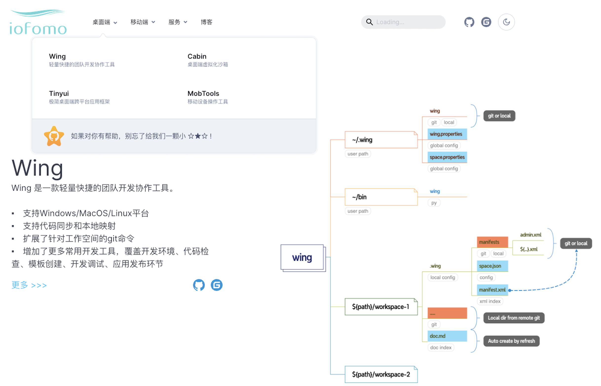
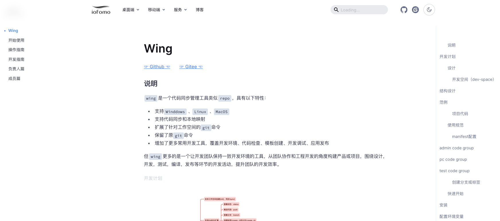
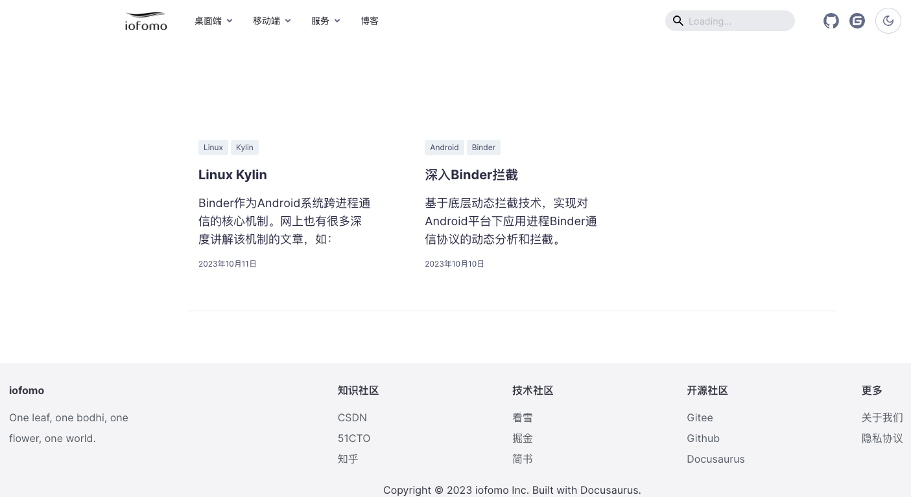
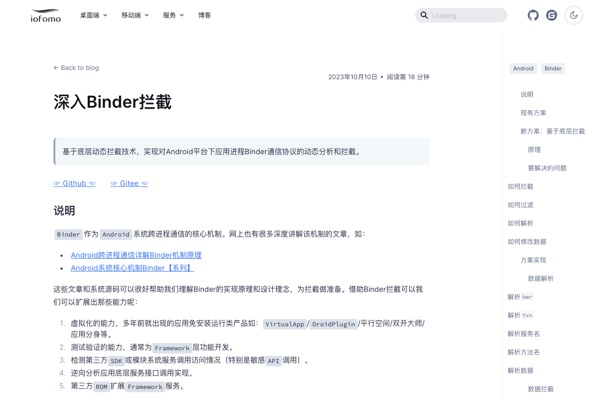
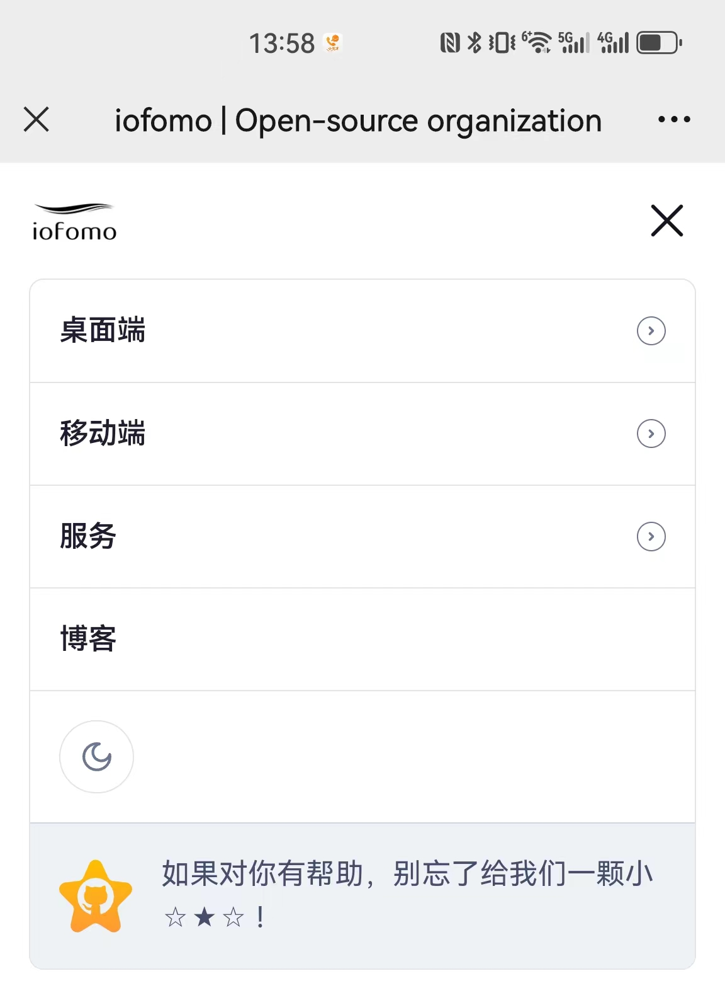

<p align="center">
  <a href="#">
    
  </a>
</p>

<p align="center">
    
    
</p>


## Instruction

This website is built using [Docusaurus 3](https://v3.docusaurus.io/), a modern static website generator. 

This is our first web development, and it is because of the following open-source project that we have our own website.

-   [refine](https://refine.dev/)
-   [apisix](https://apisix.apache.org/)

This is our official website [iofomo](https://www.iofomo.com) .

### Home



### Document



### Blog index



### Blog content



### Mobile menu



## Get Start

### Installation

```shell
$ ./make.sh install
```

### Local Development

```shell
$ ./make.sh start
```

This command starts a local development server and open up a browser window. Most changes are reflected live without having to restart the server.

### Build

```shell
$ ./make.sh build
```

This command generates static content into the `build` directory and can be served using any static contents hosting service.

### Deployment

```shell
GIT_USER=<Your GitHub username> USE_SSH=true yarn deploy
```

If you are using GitHub pages for hosting, this command is a convenient way to build the website and push to the `gh-pages` branch.

## Thanks


## LICENSE

This project is licensed under the terms of the `MIT` license. See the [LICENSE](doc/LICENSE) file.

>   This project and all tools are open source under the MIT license, which means you have full access to the source code and can modify it to fit your own needs. 
