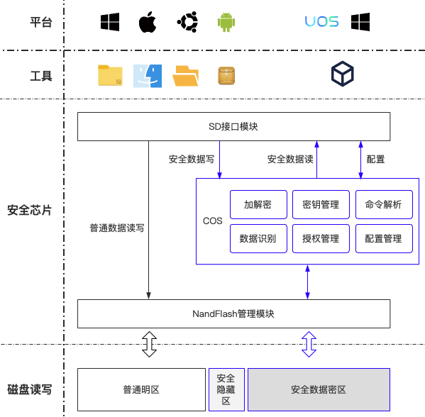
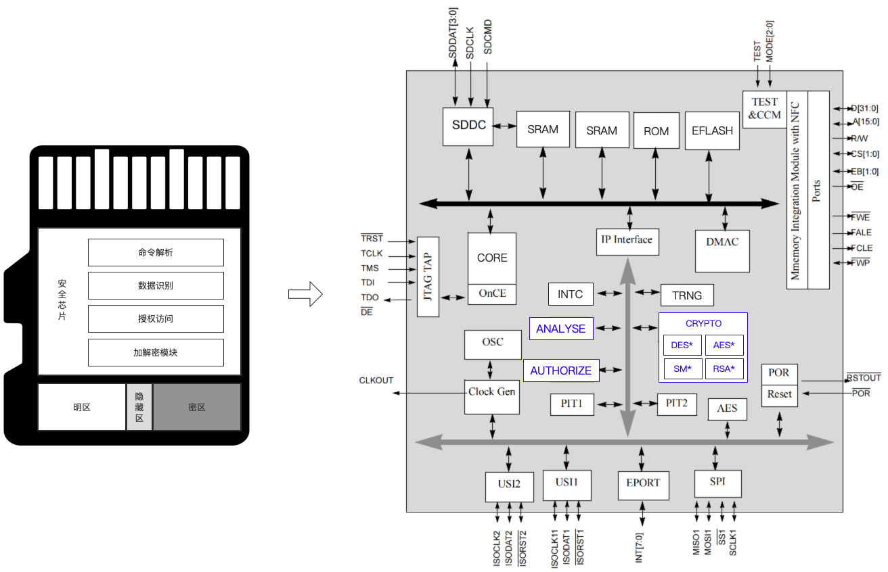
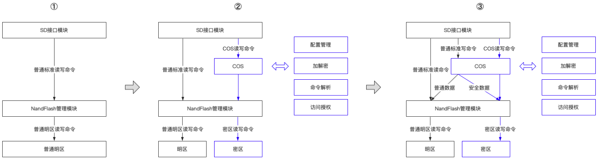
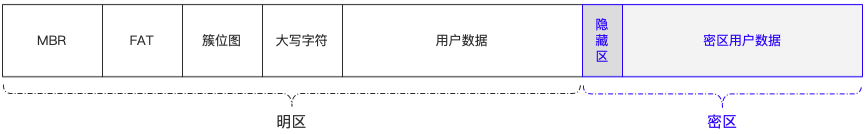
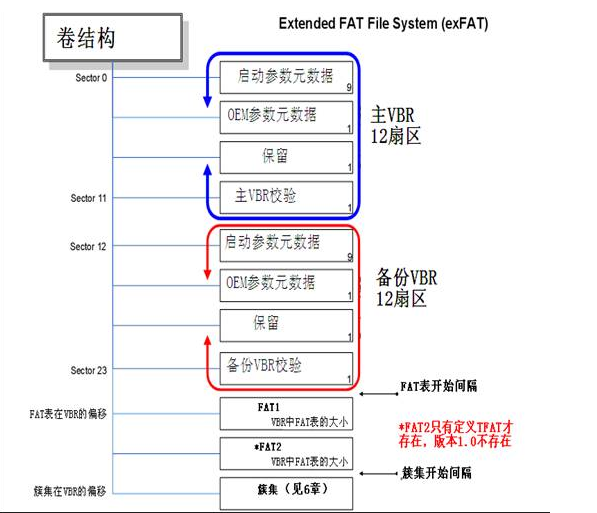
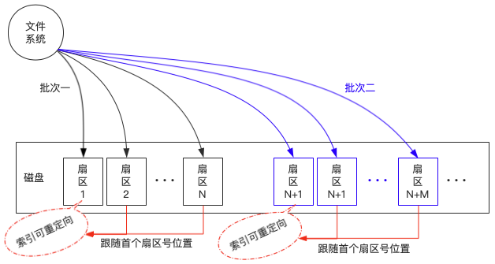
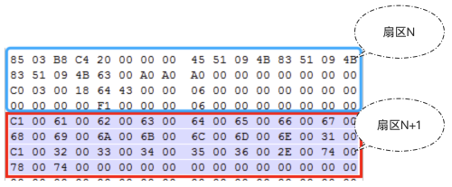
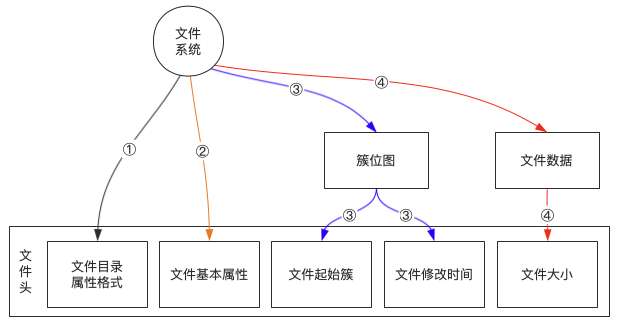
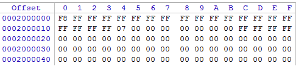
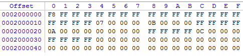

# 存储卡文件自动迁移方案

>基于TF卡存储芯片和ExFAT文件系统，从固件底层的磁盘读写指令实现上层无感数据迁移。

### 说明

##### 关键词

`COS：`即`Chip Operating System`，这里特指安全芯片内操作系统。

`TF卡：`即外置存储卡，这里特指安全存储卡。

`明区：`即TF卡的普通存储区域，普通数据区。

`密区：`即TF卡的加密存储区域，安全数据区。

`ExFAT：`即`Extended File Allocation Table File System`，扩展`FAT`，即扩展文件分配表；是`Microsoft`在`Windows`的`Embeded 5.0`以上中引入的一种适合于闪存的文件系统，为了解决`FAT32`等不支持`4G`及其更大的文件而推出。对于闪存，`NTFS`文件系统不适合使用，`ExFAT`更为适用。这里作为本方案的上层`TF卡`文件系统。

### 背景

当前场景对于安全`TF卡`核心需求为：

1.  简单易用，操作简单无需学习，开箱即用；现有方案安全数据的均需安全工具软件才能访问，不能满足多平台，体验参差不齐。
4.  环境无痕，整个操作在系统中不留痕迹，无需安装软件或运行插件；当前安全数据访问需要安装或运行特定的软件或插件。

在原安全`TF卡`技术方案上解决以上需求，即是本方案的目标。

关于简单易用性，操作系统提供了最为简单友好的文件管理软件，因此本方案的关键点就是直接利用操作系统的文件管理软件，无需进行软件或插件的开发，即可达到数据安全存储的目的。


### 技术方案

#### 设计



`说明：`

-   本方案解决了数据存储直接无需安装或运行软件或插件的问题。
-   在保存数据场景中直接使用操作系统的文件管理进行操作，简单易用，无痕。
-   在此场景下无需开发额外工具，只要操作系统文件管理可以访问标准的TF卡，即支持此安全功能。

#### 硬件

为了能够达到安全存储控制的目的，在传统的`TF卡`上增加安全芯片，其为`ARM`平台采用`SD指令`直接和`TF卡`进行通信，`TF卡`的数据加解密速度可达`25MB/S`以上。安全`TF卡`方案主要由：`SD`接口处理层、`Nandflash`管理层、`COS`、驱动四部分组成。其中`COS`主要包含：命令解析、数据识别、访问控制（授权认证）、加解密几个模块。



#### 数据流

当前主流方案为①至②的解决方案，密区的数据只能通过特定的接口进行访问。为了能够让密区的写命令也能借用普通命令通道，因此需要对写命令进行解析，并对目标数据进行重定向至密区。即方案升级为：②至③。



#### 数据存储

安全TF卡整个存储空间分布如下图所示：



1）`MBR`，即`Master Boot Record`。存储分区格式通常为`MBR`分区和`GPT`（GUID Partition Table）分区两种格式。`MBR`磁盘分区支持最大卷为2 TB（Terabytes）并且每个磁盘最多有4个主分区（或3个主分区，1个扩展分区和无限制的逻辑驱动器），这里安全`TF卡`采用`MBR`分区格式。



2）`FAT`表，本方案只有一个，`FAT2`只有定义`TFAT`才存在，本方案不涉及。

3）簇位图，是`ExFAT`文件系统中的第一个元文件，类似于`NTFS`文件系统中的元文件`$BitMap`，它的作用是用来管理分区中簇的使用情况。簇位图文件中的每一个位，映射到数据区中的每一个簇。如果某个簇分配给了文件，该簇在簇位图文件中对应的位就会被填入`“1”`，表示该簇已经占用；如果没有使用的空簇，它们在簇位图文件中对应的位就是`“0”`。

4）大写字符，是`ExFAT`文件系统中的第二个元文件，类似于`NTFS`文件系统中的元文件`$UpCase`。`Unicode`字母表中的每一个字符在这个文件中都有对应的条目，用于比较、排序、计算`Hash`值。

5）用户数据，即`ExFAT`文件系统根目录数据，具有如下特征：

-   分区中的每个文件及文件夹（也称为目录）都被分配多个大小为`32`字节的目录项，用以描述文件及文件夹的属性、大小、起始簇号和时间、日期等信息，当然还会把文件名或目录名也记录在目录项中。
-   目录也被视为特殊类型的文件，所以每个目录也与文件一样有目录项。
-   分区根目录下的文件及文件夹的目录项存放在根目录区中，分区子目录下的文件及文件夹的目录项存放在数据区相应的簇中。
-   文件系统目录项的第一个字节用来描述目录项的类型，剩下的`31`个字节用来记录文件的相关信息。

6）隐藏区，属于加密区中的一部分，用于保存加密区数据的全局配置，如设备ID、认证ID、跟密钥也业务配置数据等。

7）密区用户数据，该数据按照自定义格式存储文件数据，格式为文件头和文件数据内容两部分。

#### 解析和识别

##### SD命令接口扩展

拦截SD接口标准数据写命令，并且可以扩展修改数据存储的扇区和数据内容，如接口定义如下：

```c
/**
 * @brief: 当用户在明区保存文件数据，ExFAT文件系统处理完成，落地明区磁盘之前的回调
 * @param lba 数据起始扇区号（可重定向）
 * @param buf 数据缓存地址，该数据修改后则会影响到实际落地的数据
 * @param blockNum 数据扇区数
 * @return
 *      0: 成功, 否则操作失败，中断返回
 * */
uint8_t tf_handleDataWrite(uint32_t* lba, uint8_t *buf, uint8_t* blockNum);
```

##### ExFAT文件系统头识别

由于回调接口为底层磁盘扇区写操作接口，因此需要对传递过来的参数进行精准快速识别。需要在`COS`启动时对文件系统配置进行解析（如：簇大小，文件系统根目录偏移等）。因此首先需要了解`Main Boot Region` 主引导区`Boot Sector`（引导扇区）的数据结构。

| 偏移量 | 大小 | 描述            | 内容                                                         |
| :----- | :--- | :-------------- | :----------------------------------------------------------- |
| 0x00   | 3    | 跳转指令        | EB 76 90                                                     |
| 0x03   | 8    | 文件系统名称    | "EXFAT  "                                                    |
| 0x0B   | 53   | 保留区          | 全为0                                                        |
| 0x40   | 8    | 隐藏扇区数      |                                                              |
| 0x48   | 8    | 分区总扇区数    |                                                              |
| 0x50   | 4    | FAT表起始扇区号 |                                                              |
| 0x54   | 4    | FAT表扇区数     |                                                              |
| 0x58   | 4    | 首簇起始扇区号  |                                                              |
| 0x5C   | 4    | 分区内的总簇数  | 最大值为2^32-11                                              |
| 0x60   | 4    | 根目录首簇号    | 0x04只占1个簇                                                |
| 0x64   | 4    | 卷序列号        | 4个字节的随机数                                              |
| 0x68   | 2    | 卷版本号        | 固定为“00 01”                                                |
| 0x6A   | 2    | 卷状态          | 固定为“00 00”                                                |
| 0x6C   | 1    | 每扇区字节数    | 2^N(最小值为9à 2^9=512字节/扇区最大值为12à 2^12=4096字节/扇区) |
| 0x6D   | 1    | 每簇扇区数      | 2^N(最小值为0à 2^0=1扇区/簇最大值为25à 2^16=65536扇区/簇 = 32 MB) |
| 0x6E   | 1    | FAT表个数       | 该值为1，只有对TExFAT才为2                                   |
| 0x6F   | 1    | 驱动标记        | 这个是提供给INT13中断使用的，通常为80H                       |
| 0x70   | 1    | 分区使用百分比  | 0~100。百分之多少的簇已被分配。该值可不准确                  |
| 0x71   | 7    | 保留            | 00                                                           |
| 0x78   | 390  | 引导程序        | 固定值                                                       |
| 0x1FE  | 2    | 引导结束标志    | 0x55AA                                                       |

说明：

-   通过跳转指令和文件系统名称可以定位到文件系统的起始扇区号。
-   根据`0x6C`和`0x6D`可以获得每簇扇区数以及扇区字节数，用于文件数据内容扇区定位。

##### 目标文件数据识别

ExFAT文件系统中每个用户文件至少有三个目录项，这三个目录项被称为三个属性：第一个目录项称为“属性1”，目录项首字节的特征值为`“85H”`；第二个目录项称为“属性2”，目录项首字节的特征值为`“C0H”`；第三个目录项称为“属性3”，目录项首字节的特征值为`“C1H”`。

`1）“属性1”目录项：`

用来记录该目录项的附属目录项数、校验和、文件属性、时间戳等信息。其格式定义为：

| 偏移 | 字段长度(字节) | 说明                           |
| :--- | :------------- | :----------------------------- |
| 0x00 | 1              | 目录项的类型(特征值为“85H”)    |
| 0x01 | 1              | 附属目录项数                   |
| 0x02 | 2              | 对所有属性项的Hash校验值       |
| 0x04 | 2              | 文件属性                       |
| 0x06 | 2              | 保留                           |
| 0x08 | 4              | 文件创建时间                   |
| 0x0C | 4              | 文件最后修改时间               |
| 0x10 | 4              | 文件最后访问时间               |
| 0x14 | 1              | 文件创建时间精确至10ms         |
| 0x15 | 1              | 文件最后修改时间精确至10ms     |
| 0x16 | 1              | 创建时间时区差，间隔15分钟     |
| 0x17 | 1              | 最后修改时间时区差，间隔15分钟 |
| 0x18 | 1              | 最后访问时间时区差，间隔15分钟 |
| 0x19 | 7              | 保留                           |

该目录项可以识别目标文件的属性和起始目录项标识。

`2）“属性2”目录项：`

用来记录文件是否有碎片、文件名的字符数、文件名的Hash值、文件的起始簇号及大小等信息，格式定义如下：

| 偏移 | 字段长度(字节) | 说明                                                         |
| :--- | :------------- | :----------------------------------------------------------- |
| 0x00 | 1              | 目录项的类型(特征值为“C0H”)                                  |
| 0x01 | 1              | 文件碎片标志。如果是连续存放没有碎片，该标志为“03H”；如果是不连续存放，文件有碎片，该标志就为“01H” |
| 0x02 | 1              | 保留                                                         |
| 0x03 | 1              | 文件名字符数N。用UNICODE码表示，每个字符占用2个字节          |
| 0x04 | 2              | 文件名Hash校验值。当文件名发生改变时，Hash值也会发生改变。   |
| 0x06 | 2              | 保留                                                         |
| 0x08 | 8              | 文件大小1（文件的总字节数）                                  |
| 0x10 | 4              | 保留                                                         |
| 0x14 | 4              | 起始簇号                                                     |
| 0x18 | 8              | 文件大小2（备份值）。通常情况下与“文件大小1”的数值保持一致   |

通过属性2可以获取目标文件的大小和文件数据内容存储的起始簇号，通过起始簇号可以计算得到对应的扇区号，以及是否连续的特征。

`3）“属性3”目录项：`

用来具体记录文件的名称。如果文件名很长，“属性3”可以包含多个目录项，每个目录项称为一个片段，从上至下依次记录文件名的每一个字符。其格式定义为：

| 偏移 | 字段长度(字节) | 说明                        |
| :--- | :------------- | :-------------------------- |
| 0x00 | 1              | 目录项的类型(特征值为“C1H”) |
| 0x01 | 1              | 保留                        |
| 0x02 | 2N             | 文件名                      |

通过属性3可以获取文件名称。

##### 目标文件数据重定向

为了能够实现数据重定向，首先需要了解SD扩展接口的特性：

-   底层接口每次传递数据大小为扇区整数倍。
-   接口调用流程不可改变，否则会导致中断信号异常，上层文件系统运行错误，出现数据损坏的情况。因此在回调实现中，只能修改目标扇区位置以及本次待写入的数据内容。
-   接口回调时若本次为连续扇区操作，则仅能在首次映射时进行重定向，后续的重定向将不能生效。
    

#### 技术难点

##### SD命令接口扩展（写）

该接口在底层固件实现，使得在接收到数据存储命令后，落地磁盘扇区前，回调给`COS`进行业务处理，这是整个方案能力基础。在`COS`处理完后，再将数据写入指定扇区位置。保证流程不中断，运行稳定。

##### 精准快速识别

由于文件系统数据存储高效率要求，若`COS`中数据处理耗时，则会直接触发超时，系统提前终止写入。因此对方案高效且精准的数据识别非常高。

-   快速过滤非目标文件数据；在实际运行时，大量的磁盘读写操作与目标文件数据无关，因此需要快速返回，不影响正常使用。
-   文件头和文件内容区别识别；通常目标文件头需要精准识别，在识别完文件头后，文件内容数据则通过计算的簇链扇区号即可快速判断其合法扇区号。通常文件头格式固定，而文件内容长度则可变且长度大大超过文件头数据，因此仅通过扇区号合法性判断可以加快数据处理，提升效率。

##### 扇区重定向

重定向需要解决文件头数据不在同一扇区的问题，由于两次的回调给数据的识别和修复带来很大的麻烦。需要将两次扇区，即前一扇区的尾部和后一扇区的头部数据合并识别和修复。



为了使得上层的文件系统运行稳定，而文件头数据通常处于扇区的某个片段位置，因此回调后需要继续往明区写入数据。为了达到数据保护的目的，需要将原始文件真实数据保存至密区后，还需要对明区的数据进行伪装。

-   伪装为其他文件名或文件夹
-   伪装为空文件名
-   伪装为已删除文件

为了达到文件头数据格式正确需要对各属性项的数据进行`Hash`校验，其生成`Hash`的实现为：

```c
// 所有属性目录项的Hash值计算
unsigned short doEntrySetChecksumHash(unsigned char* octets, int NumberOfBytes)
{
    unsigned short checksum = 0;
    int index;
    for (index = 0; index < NumberOfBytes; index++) {
        if (index == 2 || index == 3) continue;
        checksum = ((checksum <<15) | (checksum>> 1)) + (unsigned short) octets[index];
    }
    return checksum;
}

unsigned char toUpper(unsigned char ch)
{
    return 'a' <= ch && ch <= 'z' ? ch - 32 : ch;
}

// 属性2目录项中对属性3目录项中hash值计算
unsigned short doNameHash(uint8_t* name, uint8_t nameLen)
{
    int i;
    unsigned short hash = 0, cc;
    for (i=0; i<nameLen; i++) {
        cc = toUpper(*name ++);
        hash = (uint16_t)(((hash << 15) | (hash >> 1)) + (cc & 0x00ff));
        hash = (uint16_t)(((hash << 15) | (hash >> 1)) + ((cc & 0xff00) >> 8));
    }
    return hash;
}
```

##### 文件头复写

通常`ExFAT`文件系统会对文件头（文件目录属性项）进行多次复写。文件目录或空文件则无第四步骤。

-   首次写入，则保存文件目录项格式（即属性1、属性2、属性3），不包含文件自身属性。
-   二次写入，则包含文件部分属性，如文件夹或文档，原文件修改时间，文件名。
-   三次写入，则包含本次文件创建时间，文件内容数据起始簇信息。
-   四次写入，则包含实际写入的数据大小即文件大小。



因此在文件头解析过程中，需要对每次回调的数据进行解析和填充，确保加密的文件头数据正确无误。

##### 簇链追踪

文件目录项记录了文件内容数据的起始簇号，数据以对应扇区号（连续或不连续）依次写入磁盘。

`FAT`表区格式：

-   `ExFAT`的每个`FAT`项由4字节构成，也就是32位的表项。
-   每个`FAT`项都有一个固定的编号，这个编号从0开始，也就是说，第一个`FAT`项是0号`FAT`项，第二个FAT项是1号`FAT`项，以此类推。
-   每个`FAT`项占用4字节：其中0号`FAT`项描述介质类型，其首字节为“F8”，表示介质类型为硬盘；1号`FAT`项写入4个“FF”；从2号`FAT`项开始对应2号簇，3号`FAT`项开始对应3号簇，一直到最后一个簇。目前2、3、4三个`FAT`项中都是结束标志，簇位图文件、大写字符文件、根目录各占一个簇。
-   分区的数据区中的每一个簇都会映射到`FAT`表中的唯一一个`FAT`项。因为0号`FAT`项和1号`FAT`项有特殊的用途，无法与数据区中的簇形成映射，所以数据区中的第一个簇也就编号为2号簇，这也是没有0号簇和1号簇的原因，然后3号簇与3号`FAT`项映射，4号簇与4号`FAT`项映射，以此类推。
-   分区格式化后，分区的两个元文件（簇位图文件和大写字符文件）及用户文件都以簇为单位存放在数据区中，一个文件至少占用一个簇。当一个文件占用多个簇时，这些簇的簇号可能是连续的，也可能是不连续的。如果文件存放的簇不连续，这些簇的簇号就以簇链的形式登记在`FAT`表中；而如果文件存放在连续的簇中，`FAT`表则不登记这些连续的簇链。

综上，`ExFAT`文件系统`FAT`表的功能主要是登记不连续存储的文件的簇链，所以在`FAT`中可以看到数值为0的`FAT`项，并不能说明该`FAT`项对应的簇是可用簇。

1）1.txt文件占0x05、0x07号簇，2.txt占0x06号簇，FAT表如下：


2）1.txt文件占0x05、0x07号簇，2.txt占0x06、0x0B、0x0C号簇，3.txt文件占0x08、0x0A号簇，4.txt占0x09号簇，FAT表如下：


因此，在识别文件内容数据时，需要从起始簇开始，对照`FAT`记录的非连续簇关系，动态生成判断扇区号是否为目标文件数据的合法性条件。

