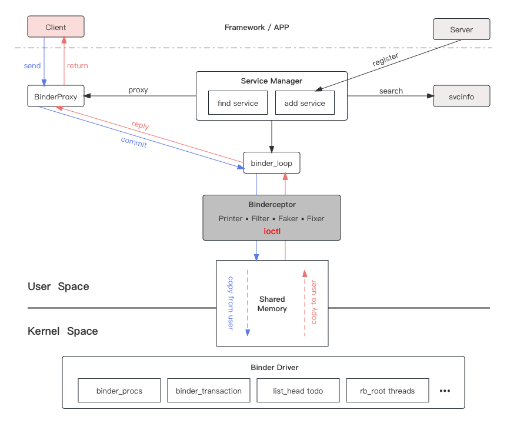
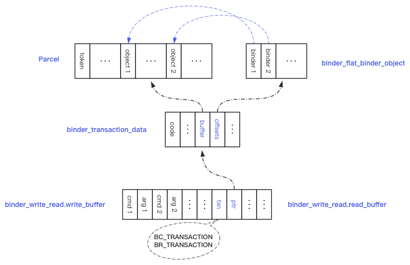
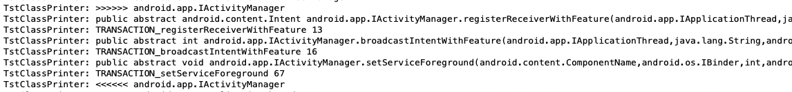

# 深入Binder拦截

>Android平台进程Binder模块的动态分析和扩展。

### 说明

`Binder`作为`Android`系统跨进程通信的核心机制。网上也有很多深度讲解该机制的文章，如：

-   [Android跨进程通信详解Binder机制原理](https://blog.csdn.net/carson_ho/article/details/73560642)
-   [Android系统核心机制Binder【系列】](https://blog.51cto.com/u_14344871/3370037)

这些文章和系统源码可以很好帮助我们理解Binder的实现原理和设计理念，为拦截做准备。借助Binder拦截可以我们可以扩展出那些能力呢：

1.  虚拟化的能力，多年前就出现的应用免安装运行类产品如：`VirtualApp`/`DroidPlugin`/平行空间/双开大师/应用分身等。
2.  测试验证的能力，通常为`Framework`层功能开发。
3.  检测第三方`SDK`或模块系统服务调用访问情况（特别是敏感`API`调用）。
4.  逆向分析应用底层服务接口调用实现。
5.  第三方`ROM`扩展`Framework`服务。

### 现有方案

一直以来实时分析和拦截进程的`Binder`通信是通过`Java`层的`AIDL`接口代理来实现的。借助于`Android`系统`Binder`服务接口设计的规范，上层的接口均继承于`IBinder`。

如一下为代理目标对象的所有的接口`API`的方法：

```java
import java.lang.reflect.InvocationHandler;
import java.lang.reflect.InvocationTargetException;
import java.lang.reflect.Proxy;

private static void getInterface(Class<?> cls, final HashSet<Class<?>> ss) {
    Class<?>[] ii;
    do {
        ii = cls.getInterfaces();
        for (final Class<?> i : ii) {
            if (ss.add(i)) {
                getInterface(i, ss);
            }
        }
        cls = cls.getSuperclass();
    } while (cls != null);
}

private static Class<?>[] getInterfaces(Class<?> cls) {
    final HashSet<Class<?>> ss = new LinkedHashSet<Class<?>>();
    getInterface(cls, ss);
    if (0 < ss.size()) {
        return ss.toArray(new Class<?>[ss.size()]);
    }
    return null;
}

public static Object createProxy(Object org, InvocationHandler cb) {
    try {
        Class<?> cls = org.getClass();
        Class<?>[] cc = getInterfaces(cls);
        return Proxy.newProxyInstance(cls.getClassLoader(), cc, cb);
    } catch (Throwable e) {
        Logger.e(e);
    } finally {
        // TODO release fix proxy name
    }
    return null;
}
```

1、对于已经生成的`Binder`服务对象，在应用进程可参与实现逻辑之前就已经缓存了，我们需要找到并且进行替换（`AMS、PMS、WMS等`），如`AMS`在Android 8.0之后的缓存如下：

```java
// source code: http://aospxref.com/android-9.0.0_r61/xref/frameworks/base/core/java/android/app/ActivityManager.java
package android.app;

public class ActivityManager {

    public static IActivityManager getService() {
        return IActivityManagerSingleton.get();
    }

    private static final Singleton<IActivityManager> IActivityManagerSingleton =
            new Singleton<IActivityManager>() {
                @Override
                protected IActivityManager create() {
                    final IBinder b = ServiceManager.getService(Context.ACTIVITY_SERVICE);
                    final IActivityManager am = IActivityManager.Stub.asInterface(b);
                    return am;
                }
            };
}
```

因此我们需要找到并且替换它，如：

```java
Object obj;
if (Build.VERSION.SDK_INT < 26) {// <= 7.0
    obj = ReflectUtils.getStaticFieldValue("android.app.ActivityManagerNative", "gDefault");
} else {// 8.0 <=
    obj = ReflectUtils.getStaticFieldValue("android.app.ActivityManager", "IActivityManagerSingleton");
}
Object inst = ReflectUtils.getFieldValue(obj, "mInstance");
ReflectUtils.setFieldValue(obj, "mInstance", createProxy(inst));
```

2、对于后续运行过程中才获取的`Binder`服务，则需要代理`ServiceManager`，源码如下：

```java
// source code: http://aospxref.com/android-9.0.0_r61/xref/frameworks/base/core/java/android/os/ServiceManager.java
package android.os;

public final class ServiceManager {
    private static final String TAG = "ServiceManager";

    private static IServiceManager sServiceManager;
}
```

因此我们的代理如下：

```java
Class<?> cls = ReflectUtils.findClass("android.os.ServiceManager");
Object org = ReflectUtils.getStaticFieldValue(cls, "sServiceManager");
Object pxy = new createProxy(org);
if (null != pxy) {
    ReflectUtils.setStaticFieldValue(getGlobalClass(), "sServiceManager", pxy);
}
```

这样每次在第一次访问该服务时，就会调用`IServiceManager`中的`getService`的方法，而该方法已经被我们代理拦截，我们可以通过参数可以识别当前获取的是哪个服务，然后将获取的服务对象代理后在继续返回即可。

`但是：`这样的方案并不能拦截进程中所有的`Binder`服务。我们面临几大问题：

1.  首先Android源码越来越庞大，了解所有的服务并不可能，因此有哪些服务已经被缓存排查非常困难。

2.  其次厂商越来越钟情于扩展自定义服务，这些服务不开源，识别和适配更加耗时。

3.  再次有一部分服务只有`native`实现，并不能通过`Java`层的接口代理进行拦截（如：`Sensor/Audio/Video/Camera服务等`）。
    ```c
    // source code: http://aospxref.com/android-13.0.0_r3/xref/frameworks/av/camera/ICamera.cpp
    
    class BpCamera: public BpInterface<ICamera>
    {
    public:
        explicit BpCamera(const sp<IBinder>& impl)
            : BpInterface<ICamera>(impl)
        {
        }
      
        // start recording mode, must call setPreviewTarget first
        status_t startRecording()
        {
            ALOGV("startRecording");
            Parcel data, reply;
            data.writeInterfaceToken(ICamera::getInterfaceDescriptor());
            remote()->transact(START_RECORDING, data, &reply);
            return reply.readInt32();
        }
    }
    ```

### 基于底层拦截

#### 原理

我们都知道`Binder`在应用进程运行原理如下图：



不管是`Java`层还是`native`层的接口调用，最后都会通过`ioctl`函数访问共享内存空间，达到跨进程访问数据交换的目的。因此我们只要拦截`ioctl`函数，即可完成对所有`Binder`通信数据的拦截。底层拦截有以下优势：

1）可以拦截所有的Binder通信。

2）底层拦截稳定，高兼容性。从`Android 4.x`至`Android 14`，近10年的系统版本演进，涉及到`Binder`底层通信适配仅两次；一次是支持64位进程（当时需要同时兼容32位和64位进程访问`Binder`服务）。另一次是华为鸿蒙系统的诞生，华为`ROM`在`Binder`通信协议中增加了新的标识字段。

#### 要解决的问题

##### 如何拦截

`C/C++`层的函数拦截，并不像`Java`层一样系统提供了较为稳定的代理工具，在这里我们直接采用网上开源的`Hook`框架：

-   https://github.com/bytedance/android-inline-hook
-   https://github.com/bytedance/bhook
-   https://github.com/asLody/whale

##### 如何过滤

`ioctl`函数为系统底层设备访问函数，调用及其频繁，而`Binder`通信调用只是其中调用者之一，因此需要快速识别非`Binder`通信调用，不影响程序性能。

函数定义：

```c
#include <sys/ioctl.h>

int ioctl(int fildes, unsigned long request, ...);
```

`request`的参数定义：

```c
// source code: http://aospxref.com/android-14.0.0_r2/xref/bionic/libc/kernel/uapi/linux/android/binder.h
#define BINDER_WRITE_READ _IOWR('b', 1, struct binder_write_read)
#define BINDER_SET_IDLE_TIMEOUT _IOW('b', 3, __s64)
#define BINDER_SET_MAX_THREADS _IOW('b', 5, __u32)
#define BINDER_SET_IDLE_PRIORITY _IOW('b', 6, __s32)
#define BINDER_SET_CONTEXT_MGR _IOW('b', 7, __s32)
#define BINDER_THREAD_EXIT _IOW('b', 8, __s32)
#define BINDER_VERSION _IOWR('b', 9, struct binder_version)
#define BINDER_GET_NODE_DEBUG_INFO _IOWR('b', 11, struct binder_node_debug_info)
#define BINDER_GET_NODE_INFO_FOR_REF _IOWR('b', 12, struct binder_node_info_for_ref)
#define BINDER_SET_CONTEXT_MGR_EXT _IOW('b', 13, struct flat_binder_object)
#define BINDER_FREEZE _IOW('b', 14, struct binder_freeze_info)
#define BINDER_GET_FROZEN_INFO _IOWR('b', 15, struct binder_frozen_status_info)
#define BINDER_ENABLE_ONEWAY_SPAM_DETECTION _IOW('b', 16, __u32)
#define BINDER_GET_EXTENDED_ERROR _IOWR('b', 17, struct binder_extended_error)
```

对应的源码：

```c
// source code: http://aospxref.com/android-14.0.0_r2/xref/frameworks/native/libs/binder/IPCThreadState.cpp
void IPCThreadState::threadDestructor(void *st) {
		ioctl(self->mProcess->mDriverFD, BINDER_THREAD_EXIT, 0);
}

status_t IPCThreadState::getProcessFreezeInfo(pid_t pid, uint32_t *sync_received, uint32_t *async_received) {
    return ioctl(self()->mProcess->mDriverFD, BINDER_GET_FROZEN_INFO, &info);
}

status_t IPCThreadState::freeze(pid_t pid, bool enable, uint32_t timeout_ms) {
    return ioctl(self()->mProcess->mDriverFD, BINDER_FREEZE, &info) < 0);
}

void IPCThreadState::logExtendedError() {
    ioctl(self()->mProcess->mDriverFD, BINDER_GET_EXTENDED_ERROR, &ee) < 0);
}

status_t IPCThreadState::talkWithDriver(bool doReceive) {
    // 实际Binder调用通信
		return ioctl(mProcess->mDriverFD, BINDER_WRITE_READ, &bwr);
}
```

快速过滤：

```c
static int ioctl_hook(int fd, int cmd, void* arg) {
		if (cmd != BINDER_WRITE_READ || !arg || g_ioctl_disabled) {
        return g_ioctl_func(fd, cmd, arg);
    }
}
```

##### 如何解析

目标源码：http://aospxref.com/android-14.0.0_r2/xref/frameworks/native/libs/binder

重点解析发送（即`BC_TRANSACTION`和`BC_REPLY`）和接收（即`BR_TRANSACTION`和`BR_REPLY`）的类型数据。

##### 如何修改数据

修改数据分为以下几种：

1）修复调用时参数数据。

2）修复调用后返回的结果数据。

如果数据修复不改变当前数据的长度，只是内容的变化，则可以直接通过地址进行修改。否则需要创建新的内存进行修改后将新的数据地址设置到`BINDER_WRITE_READ`结构的`buffer`成员。此时处理好内存的释放问题。

3）直接拦截本次调用。

为了保障稳定性，不打断`Binder`的调用流程（通常这也是拦截和逆向方案保障稳定的最重要原则之一）。我们可以将目标函数`code`修改成父类处理的通用方法，然后通过修复调用的返回值即可完成拦截。

### 方案实现

#### 数据解析

Binder调用数据结构如下：



##### 解析`bwr`

`bwr`即`binder_write_read`，从源码中了解到`ioctl`的`BINDER_WRITE_READ`类型的`arg`数据结构为：

```c
struct binder_write_read {
  // 调用时传入的数据
 	binder_size_t write_size;// call data
 	binder_size_t write_consumed;// call data
 	binder_uintptr_t write_buffer;// call data
  
	// 结果返回数据
 binder_size_t read_size;// recv data
 binder_size_t read_consumed;// recv data
 binder_uintptr_t read_buffer;// recv data
};
```

不管是传入还是返回的数据，都是一组BC命令或BR命令，也就是说一次调用上层会打包几个命令一起传递。因此我们需要通过循环来找到我们的命令。

```c
void binder_find_for_bc(struct binder_write_read& bwr) {
    binder_uintptr_t cmds = bwr.write_buffer;
    binder_uintptr_t end = cmds + (binder_uintptr_t)bwr.write_size;

    binder_txn_st* txn = NULL;
    while (0 < cmds && cmds < end && !txn) {
        // 由于每次Binder通信数据量的限制，Binder设计每次调用有且仅包含一个有效的参数命令，因此只要找到即可，其他类型则直接跳过忽略
        cmds = binder_parse_cmds_bc(cmds, txn);
    }
}
```

`dump`数据如下：

```
Trace   : read_buffer:0xb400007131d9d200, read_consumed:0, read_size:256
Trace   : 00000000:  0c 72 00 00 06 72 00 00  03 72 40 80 00 00 00 00  .r...r...r@.....
Trace   : 00000010:  00 00 00 00 00 00 00 00  00 00 00 00 00 00 00 00  ................
Trace   : 00000020:  00 00 00 00 00 00 00 00  e8 03 00 00 08 00 00 00  ................
Trace   : 00000030:  00 00 00 00 00 00 00 00  00 00 00 00 00 00 3e 1a  ..............>.
Trace   : 00000040:  71 00 00 00 08 00 3e 1a  71 00 00 00 00 00 00 00  q.....>.q.......
Trace   : 00000050:  e8 03 00 00 08 00 00 00  00 00 00 00 00 00 00 00  ................
Trace   : 00000060:  00 00 00 00 00 00 3e 1a  71 00 00 00 08 00 3e 1a  ......>.q.....>.
Trace   : 00000070:  71 00 00 00 00 00 00 00  58 c9 e6 6f 00 00 00 00  q.......X..o....
Trace   : 00000080:  b0 c9 e6 6f 00 00 00 00  f0 c9 e6 6f 00 00 00 00  ...o.......o....
Trace   : 00000090:  6c c9 e6 6f 00 00 00 00  e0 c9 e6 6f 00 00 00 00  l..o.......o....
Trace   : 000000a0:  10 ca e6 6f 00 00 00 00  7c c9 e6 6f 00 00 00 00  ...o....|..o....
Trace   : 000000b0:  f4 ca e6 6f 00 00 00 00  04 cb e6 6f 00 00 00 00  ...o.......o....
Trace   : 000000c0:  14 cb e6 6f 00 00 00 00  e4 ca e6 6f 00 00 00 00  ...o.......o....
Trace   : 000000d0:  24 cb e6 6f 00 00 00 00  0c dc e6 6f 00 00 00 00  $..o.......o....
Trace   : 000000e0:  1c dc e6 6f 00 00 00 00  3c dc e6 6f 00 00 00 00  ...o....<..o....
Trace   : 000000f0:  24 49 e6 6f 00 00 00 00  f0 de fd 6f 00 00 00 00  $I.o.......o....

Trace   : write_buffer:0xb400007131d9d100, write_consumed:0, write_size:68
Trace   : 00000000:  00 63 40 40 07 00 00 00  00 00 00 00 00 00 00 00  .c@@............
Trace   : 00000010:  00 00 00 00 05 00 00 00  12 00 00 00 00 00 00 00  ................
Trace   : 00000020:  00 00 00 00 48 00 00 00  00 00 00 00 00 00 00 00  ....H...........
Trace   : 00000030:  00 00 00 00 00 f2 d9 07  71 00 00 b4 00 00 00 00  ........q.......
Trace   : 00000040:  00 00 00 00                                       ....
```

##### 解析`txn`

`txn`即`binder_transaction_data`，Binder方法调用的方法参数信息定义如下：

```c
struct binder_transaction_data {
 union {
     __u32 handle;
     binder_uintptr_t ptr;
 } target;// 目标服务句柄，server端使用

 binder_uintptr_t cookie;// 缓存的Binder进行访问
 __u32 code;//方法编号

 __u32 flags;// 标识，如是否为 oneway
 __s32 sender_pid;
 __u32 sender_euid;
 binder_size_t data_size;// 数据长度
 binder_size_t offsets_size;// 若包含对象，则对象数据大小
  
 union {
     struct {
         binder_uintptr_t buffer;// Binder方法参数值地址
         binder_uintptr_t offsets;// Binder方法参数对象数据地址
     } ptr;
     __u8 buf[8];
 		 } data;
};
```

`dumo`数据如下：

```
Trace   : target:       1   cookie:       0   code:      23   flags:   0x12(READ REPLY)
Trace   :    pid:       0      uid:       0   size:     196    offs:8
Trace   : 00000000:  00 00 00 80 ff ff ff ff  54 53 59 53 1c 00 00 00  ........TSYS....
Trace   : 00000010:  61 00 6e 00 64 00 72 00  6f 00 69 00 64 00 2e 00  a.n.d.r.o.i.d...
Trace   : 00000020:  61 00 70 00 70 00 2e 00  49 00 41 00 63 00 74 00  a.p.p...I.A.c.t.
Trace   : 00000030:  69 00 76 00 69 00 74 00  79 00 4d 00 61 00 6e 00  i.v.i.t.y.M.a.n.
Trace   : 00000040:  61 00 67 00 65 00 72 00  00 00 00 00 85 2a 62 73  a.g.e.r......*bs
Trace   : 00000050:  13 01 00 00 00 38 dd 2a  71 00 00 b4 00 05 e9 31  .....8.*q......1
Trace   : 00000060:  71 00 00 b4 01 00 00 0c  1a 00 00 00 63 00 6f 00  q...........c.o.
Trace   : 00000070:  6d 00 2e 00 69 00 66 00  6d 00 61 00 2e 00 74 00  m...i.f.m.a...t.
Trace   : 00000080:  72 00 61 00 6e 00 73 00  65 00 63 00 2e 00 63 00  r.a.n.s.e.c...c.
Trace   : 00000090:  6f 00 6e 00 74 00 61 00  69 00 6e 00 65 00 72 00  o.n.t.a.i.n.e.r.
Trace   : 000000a0:  00 00 00 00 08 00 00 00  73 00 65 00 74 00 74 00  ........s.e.t.t.
Trace   : 000000b0:  69 00 6e 00 67 00 73 00  00 00 00 00 00 00 00 00  i.n.g.s.........
Trace   : 000000c0:  01 00 00 00                                       ....
Trace   : binder object offs:0x4c  type:0x73622a85  flags:0x113  ptr:0x2add3800  cookie:0x31e90500
```

##### 解析服务名

`Binder`通信数据头如下，即可解析出目标服务名：

```c
void find_server_name(const binder_txn_st* txn) {
		const int32_t* ptr = reinterpret_cast<const int32_t*>(txn->data.ptr.buffer);
  	++ ptr;// skip strict model
    if (29 <= sdkVersion()) ++ ptr;// 10.0 <=, skip flags(ff ff ff ff)
		
  	int32_t nameLen = *ptr;
    const uint16_t* name16 = (const uint16_t*)(ptr+1);
}
```

##### 解析方法名

`Binder`通信数据中标识该服务方法的参数是`txn->code`。`AIDL`定义类在编译后会为每个方法自动生成静态的方法。

如定义的`Binder`接口方法为：

```java
interface IDemo {
  void test();
  void test2();
}
```

则编译后生成的类为：

```java
class IDemo$Stub {
   void test();
   void test2();
   
  static final int TRANSACTION_test = 1;
  static final int TRANSACTION_test2 = 2;
}
```

因此我们可以通过反射的方式，找到服务名对应的类所有静态成员变量，然后找到与`code`值相等的成员即为此方法。

>这里需要解决私有API的限制解除问题。

```java
// 可直接使用工程工具类
TstClassPrinter.printStubByCodes("android.app.IActivityManager", 13, 16, 67);
```

日志输出如下：



##### 解析数据

首先需要借助数据封装类`Parcel`。

```c
// souce code:
// http://aospxref.com/android-14.0.0_r2/xref/frameworks/native/include/binder/Parcel.h
// http://aospxref.com/android-14.0.0_r2/xref/frameworks/native/libs/binder/Parcel.cpp
```

借助该类可以解析一些比较简单的数据，快速的找到目标内容。而对于比较复杂的数据，如参数值为`Intent`，该参数类型嵌套了多层的`Parcelable`成员，因此在`native`层通过`Parcel`来解析，兼容性比较差。因此我们选择通过回调到Java层来解析，修改后再格式化为`native`的`buffer`数据。这里需要处理好`Java`和`native`层的数据交换问题，以及回收。

`native`层：

```c
// 创建
jobject obtain(JNIEnv* env) {
    jclass jcls = env->FindClass("android/os/Parcel");
    jmethodID method = env->GetStaticMethodID(jcls, "obtain", "()Landroid/os/Parcel;");
    if (!method) return NULL;

    mParcelObj = env->CallStaticObjectMethod(jcls, method);
    if (!mParcelObj) return NULL;

    if (0 < mUparcel->dataSize()) {
        method = env->GetMethodID(sParcelClass, "setDataPosition", "(I)V");
        if (method) {
            unmarshall(env, mUparcel->data(), mUparcel->dataSize());
            env->CallVoidMethod(mParcelObj, method, mUparcel->dataPosition());
        }
    }

    return mParcelObj;
}

// 回收
void recycle(JNIEnv* env) {
    jclass jcls = env->FindClass("android/os/Parcel");
    jmethodID method = env->GetMethodID(jcls, "recycle", "()V");
    if (method) {
        env->CallVoidMethod(mParcelObj, method);
    }
    if (mParcelObj) {
        env->DeleteLocalRef(mParcelObj);
    }
    mParcelObj = NULL;
}

```

`Java`层：

```java
public static void clearHttpLink(Parcel p/*IN*/, Parcel q/*OUT*/) {
    try {
        Intent ii = Intent.CREATOR.createFromParcel(pp);
				// TODO something ...
      	
        // write new data
        q.appendFrom(p, p.dataPosition(), p.dataAvail());
    } catch (Throwable e) {
        e.printStackTrace();
    }
}
```

#### 数据拦截

Binder的数据解析和打印不会改变原数据内容，因此相对简单，如果要对数据进行修改，则相对复杂一些。修复的数据需要替换原数据，因此需要进行如下操作。

1、数据替换。

将`txn`中方法参数的数据指针指向新创建的数据区。

```c

int binder_replace_txn_for_br(binder_txn_st *txn, ParcelEx* reply, binder_size_t _pos) {
    size_t size = reply->ipcDataSize();
    uint8_t* repData = (uint8_t*)malloc(size + txn->offsets_size);
    memcpy(repData, reply->data(), size);
    if (0 < txn->offsets_size) {
        binder_replace_objects(txn, repData, _pos, ((int)size) - ((int)(txn->data_size)));
    }

    txn->data.ptr.buffer = reinterpret_cast<uintptr_t>(repData);
    txn->data_size = size;
    return 0;
}
```

2、修正对象指针。

如果传入的参数包含Binder对象，如`register`方法的`Observe`。因此修复的数据可能导致偏移的地址前移或者后移，因此需要重新计算偏移，如：

```c
void replaceObjects(binder_txn_st *txn, uint8_t* objData, binder_size_t _pos, int _off) {
    binder_size_t* offs = reinterpret_cast<binder_size_t*>(txn->data.ptr.offsets);
    unsigned count = txn->offsets_size / sizeof(binder_size_t);

    while (0 < count--) {
        if (0 != memcmp(objData + (int)(*offs), (uint8_t*)txn->data.ptr.buffer + (int)(*offs), sizeof(binder_size_t))) {
            *offs += _off;
        }
        ++ offs;
    }
}
```

3、内存释放。

需要保存原地址`A`和新的地址`AA`的映射关系到自定义的内存池中。

当`Binder`通信命令出现`BC_FREE_BUFFER`和`BR_FREE_BUFFER`时，则通过该命令要释放的`AA`地址，然后从内存池找到与之对应`A`的地址，并设置回去让上层继续释放，完成内存使用的闭环。

```c
case BC_FREE_BUFFER:
{
    uintptr_t* buffPtr = (uintptr_t *)cmd;
    uintptr_t ptr = MemPool::detach(*buffPtr);
    if (__UNLIKELY(0 != ptr)) {
        *buffPtr = ptr;// set origin buffer
    }
    cmd += sizeof(uintptr_t);// move to next command
}   break;
```

### 附：

如果你有需要，可以直接使用我们已经封装好的`SDK`来实现响应的功能，链接地址如下：

  Gitee：https://gitee.com/iofomo/binderceptor

Github：https://github.com/iofomo/binderceptor


