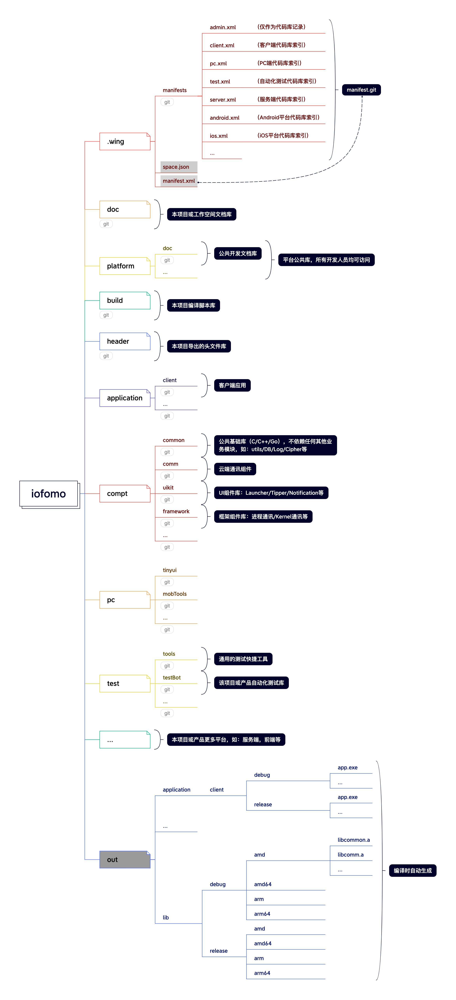

# 开发指南

### 说明

本文档旨在从技术负责人的角度，更好的根据项目或产品实际情况配置和管理好开发空间。并且可以根据自身的业务和开发习惯扩展新的命令。

### 设计

#### 开发空间（dev-space）

##### 结构设计


##### 范例



#### 项目代码

以下为本项目的代码目录简要说明，工程比较简单便于大家快速上手。

``

### 使用规范

#### manifest配置

`manifest`是指定不同的开发人员获取不同的代码库，但整个代码结构保持一致。确保团队开发人员之间，服务端编译（如：`jenkins`）开发环境均一致。通过初始化命令来获取代码索引（如：`wing init iofomo master xxx.xml`）

`manifest`中的`project`对应的是服务端库，其格式如下。

```xml
<!-- path：本地相对目录名称 -->
<!-- name：远程库相对地址 -->
<!-- revision：为指定的库分支或标签，未配置则使用默认 default 中的值，若已配置则在整体创建分支或标签时保持不变 -->
<project path="platform/doc" name="platform/doc.git" revision="master" >
    <!-- 将该库中src文件导出到本地目录下 -->
		<copyfile dest="build.py" src="build.py"/>
</project>
```

##### admin

通常`admin.xml`记录本项目或产品所有的库，不作为实际开发使用，项目或技术负责人使用此索引，可以看到整个团队开发每日详情，便于管理和代码审查。

```xml
<?xml version='1.0' encoding='UTF-8'?>
<manifest>
    <remote name="origin" fetch=".."/>

    <!-- branch -->
    <default revision="master" remote="origin" sync-j="4"/>

    <!-- doc -->
    <project path="doc" name="project/iofomo/doc.git" />

    <!-- platform: always with master -->
    <project path="platform/doc" name="platform/doc.git" revision="master" />

    <!-- Application -->
    <project path="application/client" name="project/iofomo/client.git" />

    <!-- Component -->
    <project path="compt/common" name="platform/compt/common.git" />
    <project path="compt/comm" name="platform/compt/comm.git" />
    <project path="compt/uikit" name="platform/compt/uikit.git" />
    <project path="compt/framework" name="platform/compt/framework.git" />

    <!-- PC: always with master -->
    <project path="pc/wing" name="platform/wing.git" />
    <project path="pc/tinyui" name="platform/tinyui.git" />

    <!-- Template: always with master -->
    <project path="template/as" name="platform/template_as.git" revision="master" />
    <project path="template/as_mts" name="platform/template_as_jni.git" revision="master" />
    <project path="template/as_jar" name="platform/template_as_jar.git" revision="master" />
    <project path="template/py" name="platform/template_py.git" revision="master" />

    <!-- server -->
    <project path="server/fomosite" name="project/iofomo/fomosite.git" />
    <project path="server/web" name="project/iofomo/web.git" />
    <project path="server/vue" name="project/iofomo/vue.git" />

    <!-- Test -->
    <project path="test/tools" name="platform/tools.git" revision="master" />
    <project path="test/testBot" name="project/iofomo/testBot.git" />

    <!-- build -->
    <project path="build" name="project/iofomo/build">
        <!--<copyfile dest="build.py" src="build.py"/>-->
    </project>

</manifest>
```

##### pc

这是`pc`组代码索引配置，里面仅包含公共库和`pc`相关的代码库。

```xml
<?xml version='1.0' encoding='UTF-8'?>
<manifest>
    <remote name="origin" fetch=".."/>

    <!-- branch -->
    <default revision="master" remote="origin" sync-j="4"/>

    <!-- doc -->
    <project path="doc" name="project/iofomo/doc.git" />

    <!-- platform: always with master -->
    <project path="platform/doc" name="platform/doc.git" revision="master" />

    <!-- PC: always with master -->
    <project path="pc/wing" name="platform/wing.git" />
    <project path="pc/tinyui" name="platform/tinyui.git" />

    <!-- Test -->
    <project path="test/tools" name="platform/tools.git" revision="master" />
    <project path="test/testBot" name="project/iofomo/testBot.git" />

    <!-- build -->
    <project path="build" name="project/iofomo/build">
        <!--<copyfile dest="build.py" src="build.py"/>-->
    </project>

</manifest>
```

##### test

这是自动化测试开发组代码索引配置，里面仅包含公共库和`test`相关的代码库。

```xml
<?xml version='1.0' encoding='UTF-8'?>
<manifest>
    <remote name="origin" fetch=".."/>

    <!-- branch -->
    <default revision="master" remote="origin" sync-j="4"/>

    <!-- doc -->
    <project path="doc" name="project/iofomo/doc.git" />

    <!-- platform: always with master -->
    <project path="platform/doc" name="platform/doc.git" revision="master" />

    <!-- Test -->
    <project path="test/tools" name="platform/tools.git" revision="master" />
    <project path="test/testBot" name="project/iofomo/testBot.git" />

    <!-- build -->
    <project path="build" name="project/iofomo/build">
        <!--<copyfile dest="build.py" src="build.py"/>-->
    </project>

</manifest>
```

#### 创建分支或标签

如通过命令`wing -create b release_v1.0.0 master`即基于`master`分支创建新的`release_v1.0.0`分支（标签命令同理）。则：

-   `manifest`所在的`Git`库会自动创建一个`release_v1.0.0`的分支。

-   `manifest`中所有的`xml`索引文件中`default`默认分支的值为`release_v1.0.0`

    ><default revision="release_v1.0.0" remote="origin" sync-j="4"/>

如`test.xml`在新的分支内容变更如下，公共库（即指定`revision`分支）保持不变：

```xml
<?xml version='1.0' encoding='UTF-8'?>
<manifest>
    <remote name="origin" fetch=".."/>

    <!-- branch -->
    <default revision="release_v1.0.0" remote="origin" sync-j="4"/>

    <!-- doc -->
    <project path="doc" name="project/iofomo/doc.git" />

    <!-- platform: always with master -->
    <project path="platform/doc" name="platform/doc.git" revision="master" />

    <!-- Test -->
    <project path="test/tools" name="platform/tools.git" revision="master" />
    <project path="test/testBot" name="project/iofomo/testBot.git" />

    <!-- build -->
    <project path="build" name="project/iofomo/build">
        <!--<copyfile dest="build.py" src="build.py"/>-->
    </project>

</manifest>
```

### 扩展开发

若继续扩展新的命令，则只需在以下三个地方进行修改。

#### 命令说明

编辑`res/help.txt`文件，简要描述命令参数的格式和功能。

#### 命令入口

在`framework/wing_extend.py`中增加命令转发，如扩展一个命令：`wing -demo abc`。

```python
def doDemo(argv):
    """
    wing -demo {argument}
    """
    succ = CmnUtils.doCmdCall('cd "%s" && python extend/extend_demo.py "%s" "%s" %s' % (WingEnv.getWingPath(), \
                                                                                        WingEnv.getEnvPath(), \
                                                                                        WingEnv.getSpacePath(), \
                                                                                        CmnUtils.joinArgs(argv))\
                             )
    assert succ, 'demo command fail'
    LoggerUtils.light('\ndone.')

def run(_argv):
    if '-demo' == typ: return doDemo(argv)
```

#### 命令实现

新增`extend/extend_demo.py`文件，实现该命令的功能，模板如下：

```python
#!/usr/bin/env python
# -*- coding:utf-8 -*-
# @brief:  ...
# @date:   ...

import sys, os

g_this_file = os.path.realpath(sys.argv[0])
g_this_path = os.path.dirname(g_this_file)
sys.path.append(os.path.dirname(g_this_path))

from utils.utils_cmn import CmnUtils
from utils.utils_file import FileUtils
from utils.utils_logger import LoggerUtils
from utils.utils_import import ImportUtils
from basic.git import BasicGit
from basic.arguments import BasicArgumentsValue

ImportUtils.initEnv()


# --------------------------------------------------------------------------------------------------------------------------
class ExtendClean:
    def __init__(self, spacePath, envPath):
        self.mSpacePath, self.mEnvPath = spacePath, envPath
        self.mProjPath = self.__getProjectPath__(envPath)

    def doClean(self, arg):
        # TODO something here ...
			  pass


def run():
    """
    wing -demo {argument}
    """
    if len(sys.argv) <= 3:
        LoggerUtils.println('The most similar command is')
        LoggerUtils.println('    wing -demo abc')
        return

    za = BasicArgumentsValue()
    envPath, spacePath, arg = za.get(0), za.get(1), za.get(2)
    zc = ExtendDemo(spacePath, envPath)
    zc.doDemo(arg)


if __name__ == "__main__":
    run()
```

