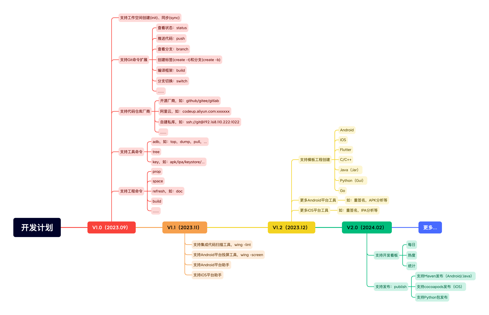
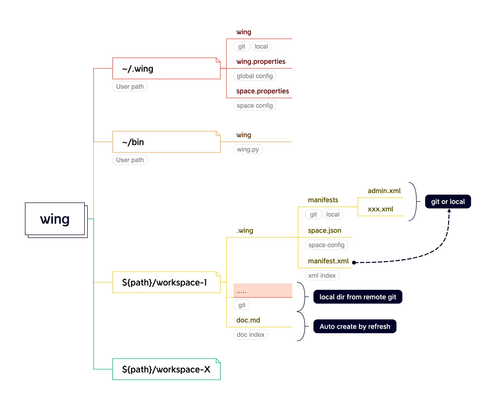
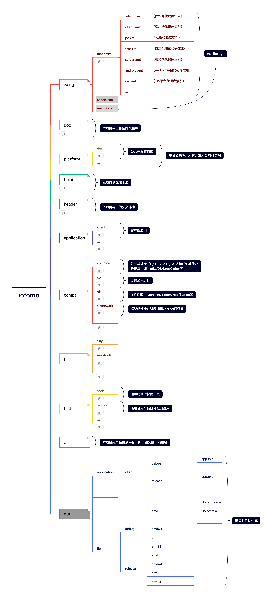
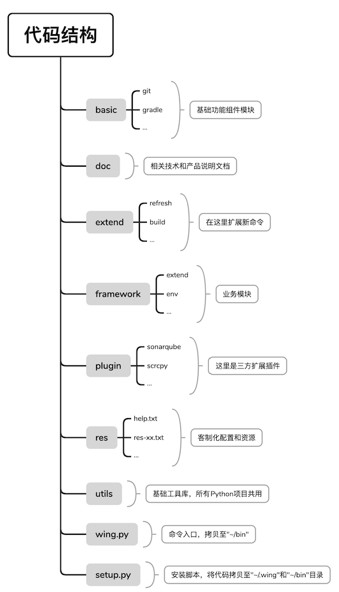

# Wing

[☞ Github ☜](https://www.github.com/iofomo/wing)　　[☞ Gitee ☜](https://www.gitee.com/iofomo/wing)

### 说明

`wing`是一个代码同步管理工具类似`repo`，具有以下特性：

-   支持`Winddows` 、`Linux` 、`MacOS`
-   支持代码同步和本地映射
-   扩展了针对工作空间的`git`命令 
-   保留了原`git`命令
-   增加了更多常用开发工具，覆盖开发环境、代码检查、模板创建、开发调试、应用发布

但`wing`更多的是一个让开发团队保持一致开发环境的工具，从团队协作和工程开发的角度构建产品或项目，围绕设计，开发，测试，编译，发布等环节的开发活动，提升团队的开发效率。

##### 开发计划



### 设计

#### 开发空间（dev-space）

##### 结构设计



##### 范例



#### 项目代码

以下为本项目的代码目录简要说明，工程比较简单便于大家快速上手。



### 使用规范

#### manifest配置

`manifest`是指定不同的开发人员获取不同的代码库，但整个代码结构保持一致。确保团队开发人员之间，服务端编译（如：`jenkins`）开发环境均一致。通过初始化命令来获取代码索引（如：`wing init iofomo master xxx.xml`）

`manifest`中的`project`对应的是服务端库，其格式如下。

```xml
<!-- path：本地相对目录名称 -->
<!-- name：远程库相对地址 -->
<!-- revision：为指定的库分支或标签，未配置则使用默认 default 中的值，若已配置则在整体创建分支或标签时保持不变 -->
<project path="platform/doc" name="platform/doc.git" revision="master" >
    <!-- 将该库中src文件导出到本地目录下 -->
		<copyfile dest="build.py" src="build.py"/>
</project>
```

##### admin code group

通常`admin.xml`记录本项目或产品所有的库，不作为实际开发使用，项目或技术负责人使用此索引，可以看到整个团队开发每日详情，便于管理和代码审查。

```xml
<?xml version="1.0" encoding="UTF-8"?>
<manifest>
    <remote name="origin" fetch=".."/>

    <!-- branch -->
    <default revision="master" remote="origin" sync-j="4"/>

    <!-- doc -->
    <project path="doc" name="project/iofomo/doc.git" />

    <!-- platform: always with master -->
    <project path="platform/doc" name="platform/doc.git" revision="master" />

    <!-- Application -->
    <project path="application/client" name="project/iofomo/client.git" />

    <!-- Component -->
    <project path="compt/common" name="platform/compt/common.git" />
    <project path="compt/comm" name="platform/compt/comm.git" />
    <project path="compt/uikit" name="platform/compt/uikit.git" />
    <project path="compt/framework" name="platform/compt/framework.git" />

    <!-- PC: always with master -->
    <project path="pc/wing" name="platform/wing.git" />
    <project path="pc/tinyui" name="platform/tinyui.git" />

    <!-- Template: always with master -->
    <project path="template/as" name="platform/template_as.git" revision="master" />
    <project path="template/as_mts" name="platform/template_as_jni.git" revision="master" />
    <project path="template/as_jar" name="platform/template_as_jar.git" revision="master" />
    <project path="template/py" name="platform/template_py.git" revision="master" />

    <!-- server -->
    <project path="server/fomosite" name="project/iofomo/fomosite.git" />
    <project path="server/web" name="project/iofomo/web.git" />
    <project path="server/vue" name="project/iofomo/vue.git" />

    <!-- Test -->
    <project path="test/tools" name="platform/tools.git" revision="master" />
    <project path="test/testBot" name="project/iofomo/testBot.git" />

    <!-- build -->
    <project path="build" name="project/iofomo/build">
        <!--<copyfile dest="build.py" src="build.py"/>-->
    </project>

</manifest>
```

##### pc code group

这是`pc`组代码索引配置，里面仅包含公共库和`pc`相关的代码库。

```xml
<?xml version="1.0" encoding="UTF-8"?>
<manifest>
    <remote name="origin" fetch=".."/>

    <!-- branch -->
    <default revision="master" remote="origin" sync-j="4"/>

    <!-- doc -->
    <project path="doc" name="project/iofomo/doc.git" />

    <!-- platform: always with master -->
    <project path="platform/doc" name="platform/doc.git" revision="master" />

    <!-- PC: always with master -->
    <project path="pc/wing" name="platform/wing.git" />
    <project path="pc/tinyui" name="platform/tinyui.git" />

    <!-- Test -->
    <project path="test/tools" name="platform/tools.git" revision="master" />
    <project path="test/testBot" name="project/iofomo/testBot.git" />

    <!-- build -->
    <project path="build" name="project/iofomo/build">
        <!--<copyfile dest="build.py" src="build.py"/>-->
    </project>

</manifest>
```

##### test code group

这是自动化测试开发组代码索引配置，里面仅包含公共库和`test`相关的代码库。

```xml
<?xml version="1.0" encoding="UTF-8"?>
<manifest>
    <remote name="origin" fetch=".."/>

    <!-- branch -->
    <default revision="master" remote="origin" sync-j="4"/>

    <!-- doc -->
    <project path="doc" name="project/iofomo/doc.git" />

    <!-- platform: always with master -->
    <project path="platform/doc" name="platform/doc.git" revision="master" />

    <!-- Test -->
    <project path="test/tools" name="platform/tools.git" revision="master" />
    <project path="test/testBot" name="project/iofomo/testBot.git" />

    <!-- build -->
    <project path="build" name="project/iofomo/build">
        <!--<copyfile dest="build.py" src="build.py"/>-->
    </project>

</manifest>
```

#### 创建分支或标签

如通过命令`wing -create b release_v1.0.0 master`即基于`master`分支创建新的`release_v1.0.0`分支（标签命令同理）。则：

-   `manifest`所在的`Git`库会自动创建一个`release_v1.0.0`的分支。

-   `manifest`中所有的`xml`索引文件中`default`默认分支的值为`release_v1.0.0`

    >`<default revision="release_v1.0.0" remote="origin" sync-j="4"/>`

如`test.xml`在新的分支内容变更如下，公共库（即指定`revision`分支）保持不变：

```xml
<?xml version="1.0" encoding="UTF-8"?>
<manifest>
    <remote name="origin" fetch=".."/>

    <!-- branch -->
    <default revision="release_v1.0.0" remote="origin" sync-j="4"/>

    <!-- doc -->
    <project path="doc" name="project/iofomo/doc.git" />

    <!-- platform: always with master -->
    <project path="platform/doc" name="platform/doc.git" revision="master" />

    <!-- Test -->
    <project path="test/tools" name="platform/tools.git" revision="master" />
    <project path="test/testBot" name="project/iofomo/testBot.git" />

    <!-- build -->
    <project path="build" name="project/iofomo/build">
        <!--<copyfile dest="build.py" src="build.py"/>-->
    </project>
</manifest>
```

### 快速开始

>新手操作看 [这里](https://gitee.com/iofomo/wing/blob/master/doc/get-start.md)

##### 安装

```shell
$ python setup.py install
```

##### 配置环境变量

**Windows：**

将`C:\Users\${user name}\bin`添加至系统环境变量。

**Linux/MacOS：**

将`~/bin`配置为可执行全局目录。

##### 创建工作空间

添加工作空间对应的代码`git`库服务地址，如：

```shell
# 本地索引模式
# `wing -space add {space name} {git host} [manifest]`
# such as:
$ wing -space add test git@github.com/iofomo
```

##### 获取代码

```shell
$ mkdir test
$ cd test

# `wing init {space name} {branch/tag} {manifest file}`
# such as:
$ wing init test master admin.xml
```

在当前目录下自动创建一个空的模板索引文件（`.wing/manifests/admin.xml`），需要添加要同步的代码库映射关系。

### 许可协议

本项目基于`MIT`许可协议，详情查看 [许可协议](/docs/about/privacy) 文档。

>   本项目和所有的工具都是MIT许可证下的开源工具，这意味着你可以完全访问源代码，并可以根据自己的需求进行修改。
