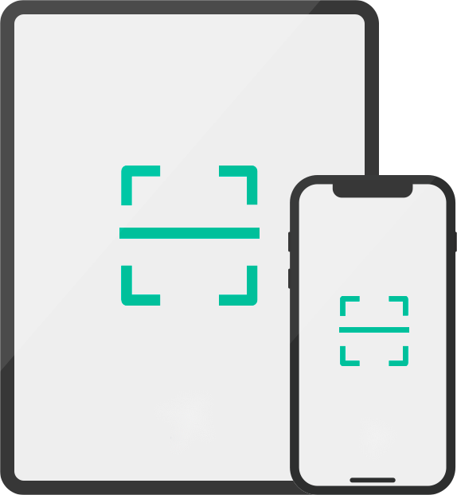

# 获取UDID

>服务即将上线并开源，敬请期待 ······

### 快速获取本机的 UDID 信息

请使用`iPhone`或`iPad`上的`Safari`浏览器打开本页面或者扫描下面的二维码，即可快速获取`UDID`：

### 什么是UDID?

`UDID`，是`iOS`设备的一个唯一识别码，每台`iOS`设备都有一个独一无二的编码，这个编码，我们称之为识别码，也叫做`UDID`（Unique Device Identifier）。

### 扫描后系统提示输入密码?

如果您扫描后系统提示输入密码，请输入锁屏密码。
